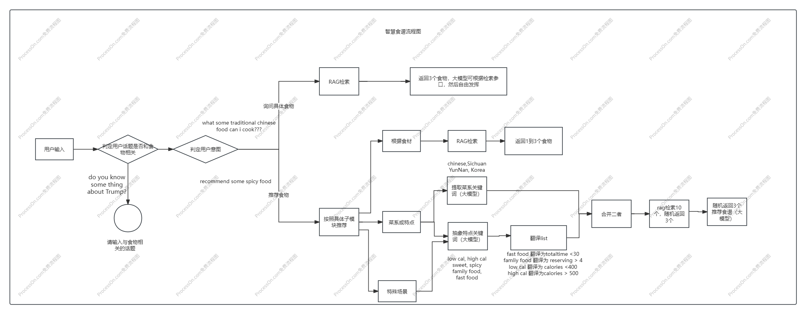
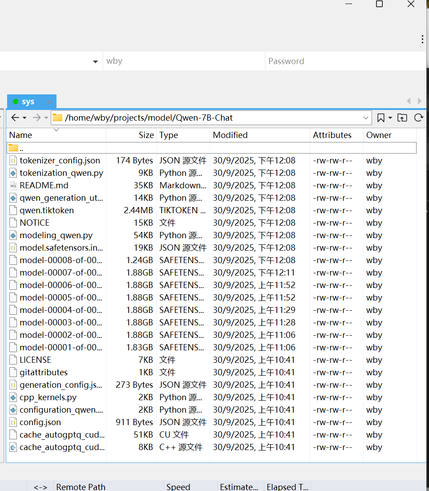

[🍽️ AI智慧食谱 (AI Recipe Assistant) README.md](https://github.com/user-attachments/files/26086737/AI.AI.Recipe.Assistant.README.md)
# 🍽️ AI智慧食谱 (AI Recipe Assistant)

### 基于本地部署大模型的智能食谱推荐系统

> **项目周期**：2025.10 - 2025.11
>
> **运行环境**：实验室Linux服务器（本地部署，无法外网访问）
>
> **核心技术栈**：QWEN-7B (LoRA微调) + RAG + 三层COT过滤 + Vue2

------

## 📸 系统流程图

*（上图展示了系统的核心决策流程：三层COT过滤 + 意图识别 + 多路召回）*

------

## 🏗 项目背景与限制

本项目是在**实验室本地服务器**上完成的完整AI应用落地实践。由于以下原因，系统无法在公网运行：

- 模型为**本地部署的QWEN-7B**（需GPU资源）
- Chroma向量数据库包含**50万条清洗后的食谱数据**（体积过大，无法上传GitHub）
- 依赖实验室特定环境配置（实验室服务器规定，不能连接外网）

------

## 🧠 核心技术实现

### 1. 模型层：QWEN-7B + LoRA微调

- 选用通义千问7B作为基座模型
- 因实验室无法翻墙，**全程手动下载模型文件并本地部署**
- 针对食谱领域进行**LoRA微调**，提升输出格式规范性（如强制输出JSON）

### 2. RAG检索层：50万数据 + Chroma+ 【all-MiniLM-L6-v2】

- 清洗并结构化50万条食谱数据
- 存入Chroma向量数据库，实现高效语义检索
- **数据库本地存储，无法上传GitHub，但检索逻辑完整可展示**

### 3. 逻辑控制层：三层COT过滤

这是我设计的**核心创新点**，解决大模型在垂直领域的输出失控问题：

| 层级       | 功能     | 技术实现                                                   |
| :--------- | :------- | :--------------------------------------------------------- |
| **第一层** | 话题过滤 | 判断用户输入是否与食物相关（拒绝非食物话题，如政治、科技） |
| **第二层** | 意图分类 | 区分“根据食材推荐” vs “根据菜系推荐” vs “特定场景需求”     |
| **第三层** | 场景规则 | 内置规则引擎（如healthy meal、low cal等条件过滤）          |

### 4. 后端服务：FastAPI + 业务逻辑编排

- 将COT过滤、RAG检索、模型调用编排为完整服务链路
- 实现**流式输出**，提升用户体验

### 5. 前端展示：Vue2 + Element UI

- 简洁对话界面
- 支持食谱展示、食材输入、场景选择

------

# 重要文件说明
recipe-test是前端代码，week5是后端代码

week5/code_rag/rag_test.ipynb 是整个项目的核心文件，它记录着我的大模型的很多子模块实验  
week5/code_rag/mode_tiao.ipynb 是微调代码  
整个向量数据库用的是chroma， 检索model是all-MiniLM-L6-V2, 使用的大模型是QWEN-7B-Chat测试版  
week5/tools/batch_store_to_chroma，是把当前批次的embedding存入到chroma数据库里 
week5/code_rag/data_batch_loader，是总的把embedding存入到chroma数据库里的总脚本 
week5/code_rag/clean2.ipynb，是数据清洗实验的jupyter文件 
wee5/tools/test_connect，是跑后端服务器的脚本

------

## 🔄 系统工作流程（以“推荐低卡食谱”为例）

1. 用户输入：“推荐几个低卡路里的菜”
2. **第一层COT**：判定与食物相关 → 通过
3. **第二层COT**：判定意图为“特殊场景” → 进入low cal分支
4. **第三层COT**：规则引擎匹配 calories < 400
5. RAG检索：从50万数据中召回符合条件的前10条
6. 模型生成：QWEN-7B将召回数据整理为自然语言回复
7. 前端展示：流式输出结果

------

## 💡 技术难点与解决方案

| 难点                                               | 解决方案                                                |
| :------------------------------------------------- | :------------------------------------------------------ |
| **无法翻墙，无法用HuggingFace**                    | 手动下载模型文件，本地导入；所有依赖包离线安装          |
| **7B模型推理速度慢**                               | 优化batch size，采用流式输出减少首字等待时间            |
| **大模型输出不稳定（乱输出JSON、非食物话题乱答）** | 设计**三层COT过滤层**，强制模型走决策分支               |
| **RAG召回不准确**                                  | 优化Embedding模型（BGE），调整chunk大小                 |
| **数据库并发冲突**                                 | （当时还未重构连接池，但在后续Multi-Agent项目中已解决） |

------

## 🛠️ 技术栈

| 层级       | 技术               | 说明                   |
| :--------- | :----------------- | :--------------------- |
| **前端**   | Vue2 + Element UI  | 对话界面与食谱展示     |
| **后端**   | FastAPI            | 业务逻辑编排           |
| **数据库** | Chroma             | 50万食谱向量库         |
| **模型**   | QWEN-7B (LoRA微调) | 本地部署，无法外网访问 |
| **嵌入**   | BGE                | 用于RAG检索            |
| **部署**   | Linux实验室服务器  | 内网环境，无公网访问   |

------

## 🔗 相关项目

- [🚀 计算机自救小助手 (Multi-Agent系统)](https://github.com/oneBoy128/cs-self-help-assistant) —— 基于LangGraph的七个智能体协同系统

------

## 👨‍💻 作者

- 汪博艺 - oneBoy
- GitHub：https://github.com/oneBoy128

------

## 📝 开发者感悟

> “这个项目是我第一次真正理解：AI落地不是调个API就行。不能翻墙、模型太大、输出不稳定、数据清洗……每一个坑都是自己填的。三层COT的设计，就是被模型乱输出逼出来的。回头看，那些‘笨办法’反而成了最扎实的经验。”

